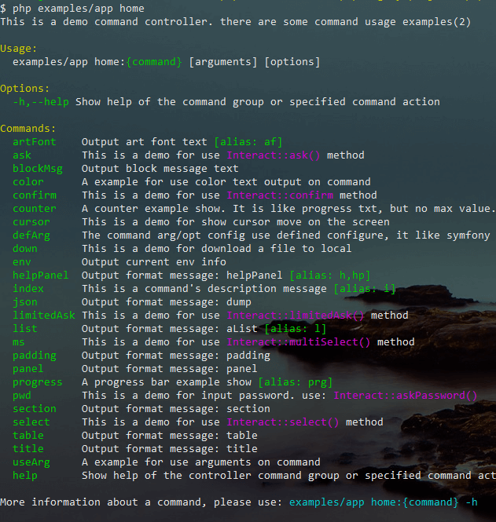
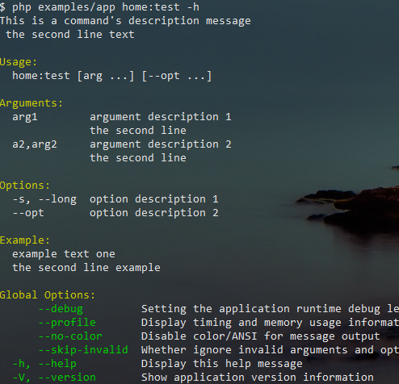
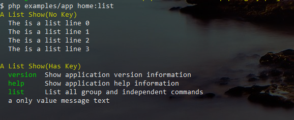
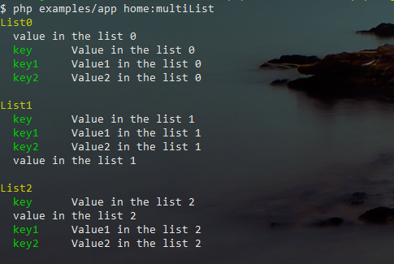
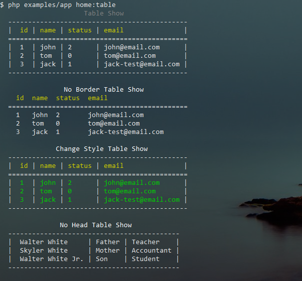
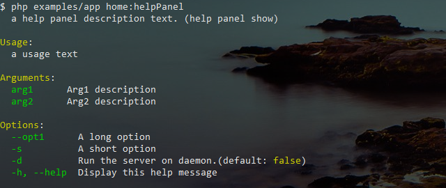

# php 命令行应用库

[](LICENSE)
[](https://packagist.org/packages/inhere/console)
[](https://packagist.org/packages/inhere/console)

简洁、功能全面的php命令行应用库。提供控制台参数解析, 命令运行，颜色风格输出, 用户信息交互, 特殊格式信息显示。

> 使用方便简单。可以方便的整合到任何已有项目中。

- 命令行应用, 命令行的 `controller`, `command` 解析运行, 支持给命令设置别名
- 功能全面的命令行的选项参数解析(命名参数，短选项，长选项 ...)
- 命令行中功能强大的 `input`, `output` 管理、使用
- 命令方法注释自动解析为帮助信息（默认提取 `@usage` `@arguments` `@options` `@example` 等信息）
- 支持输出多种颜色风格的消息文本(`info`, `comment`, `success`, `warning`, `danger`, `error` ... )
- 常用的特殊格式信息显示(`section`, `panel`, `padding`, `helpPanel`, `table`, `tree`, `title`, `list`, `multiList`)
- 丰富的动态信息显示(`pending/loading`, `pointing`, `spinner`, `counterTxt`, `progressTxt`, `progressBar`)
- 常用的用户信息交互支持(`select`, `multiSelect`, `confirm`, `ask/question`, `askPassword/askHiddenInput`)
- 支持类似 `symfony/console` 的预定义参数定义(按位置赋予参数值, 需要严格限制参数选项时推荐使用)
- 输出是 `windows` , `linux` 兼容的，不支持颜色的环境会自动去除相关CODE

**内置工具**

- `PharCompiler::class` 内置Phar工具类，可以方便的将应用打包成`phar`文件。方便分发和使用
  - 运行示例中的命令 `php examples/app phar:pack`,会将此console库打包成一个`app.phar`
- `ArtFont::class` 支持 ansi 图案字体显示（运行 `php examples/app -V` 可以看到效果）
- `Download::class` 内置的简单的文件下载工具类，带有进度条
- `Terminal::class` 简单的Terminal屏幕、光标控制操作类
- `ProcessUtil::class` 简单的进程操作使用类（fork,run,stop,wait ... 等）
- **TODO** 快速的为当前应用生成 `bash/zsh` 环境下的自动补全脚本

> 下面所有的特性，效果都是运行 `examples/` 中的示例代码 `php examples/app` 展示出来的。基本上涵盖了所有功能，可以直接测试运行

## [EN README](./README_en.md)

## 项目地址

- **github** https://github.com/inhere/php-console.git
- **git@osc** https://gitee.com/inhere/php-console.git

**注意：**

- master 分支是要求 `php >= 7` 的(推荐使用)。
- php5 分支是支持 php5 `php >= 5.5` 的代码分支。

## 安装

- 使用 composer 命令

```bash
composer require inhere/console
```

- 使用 composer.json

编辑 `composer.json`，在 `require` 添加

```
"inhere/console": "dev-master",

// "inhere/console": "^2.0", // 指定稳定版本
// "inhere/console": "dev-php5", // for php5
```

然后执行: `composer update`

- 直接拉取

```
git clone https://git.oschina.net/inhere/php-console.git // git@osc
git clone https://github.com/inhere/php-console.git // github
```

## 快速开始

如下，新建一个入口文件。 就可以开始使用了

```php
// file: examples/app
use Inhere\Console\IO\Input;
use Inhere\Console\IO\Output;

$meta = [
    'name' => 'My Console App',
    'version' => '1.0.2',
];
$input = new Input;
$output = new Output;
// 通常无需传入 $input $output ，会自动创建
$app = new \Inhere\Console\Application($meta, $input, $output);

// add command routes
$app->command('demo', function (Input $in, Output $out) {
    $cmd = $in->getCommand();

    $out->info('hello, this is a test command: ' . $cmd);
});
// ... ...

// run
$app->run();
```

然后在命令行里执行 `php examples/app`, 立即就可以看到如下输出了:


> `Alone Commands` 中的 demo 就是我们上面添加的命令

## 添加命令

添加命令的方式有三种

### 1. 使用闭包

如上所示，使用闭包可以快速的添加一个简单的命令

```php
$app->command('demo', function (Input $in, Output $out) {
    $cmd = $in->getCommand();

    $out->info('hello, this is a test command: ' . $cmd);
}, 'this is message for the command');
```

### 2. 独立命令

通过继承 `Inhere\Console\Command` 添加独立命令

> 独立命令 - 只有一个命令可执行，跟 `symfony/console` 的 command 一样

```php
use Inhere\Console\Command;

/**
 * Class TestCommand
 * @package app\console\commands
 */
class TestCommand extends Command
{
    // 命令名称
    protected static $name = 'test';
    // 命令描述
    protected static $description = 'this is a test independent command';

    // 注释中的 @usage @arguments @options @example 在使用 帮助命令时，会被解析并显示出来

    /**
     * @usage usage message
     * @arguments 
     *  arg     some message ...
     *  
     * @options 
     *  -o, --opt     some message ...
     *  
     * @param  Inhere\Console\IO\Input $input
     * @param  Inhere\Console\IO\Output $output
     * @return int
     */
    public function execute($input, $output)
    {
        $output->write('hello, this in ' . __METHOD__);
    }
}
```

### 3. 命令组

当一些命令相关性较大时，写在同一个文件里更方便阅读和管理。

通过继承 `Inhere\Console\Controller` 添加一组命令. 即是命令行的控制器

```php
use Inhere\Console\Controller;

/**
 * default command controller. there are some command usage examples
 */
class HomeController extends Controller
{
    // 命令组名称
    protected static $name = 'home';
    // 命令组描述
    protected static $description = 'default command controller. there are some command usage examples';

    /**
     * this is a command's description message, <cyan>color text</cyan>
     * the second line text
     * @usage {command} [arg ...] [--opt ...]
     * @arguments
     *  arg1        argument description 1
     *              the second line
     *  a2,arg2     argument description 2
     *              the second line
     * @options
     *  -s, --long  option description 1
     *  --opt       option description 2
     * @example example text one
     *  the second line example
     */
    public function testCommand()
    {
        $this->write('hello, welcome!! this is ' . __METHOD__);
    }
    
    /**
     * a example for use color text output on command
     */
    public function otherCommand()
    {
        $this->write('hello, welcome!! this is ' . __METHOD__);
    }
}
```

## 注册命令

 在 `$app->run()` 之前
 
- 通过 `$app->command(TestCommand::class)` 注册独立命令。
- 通过 `$app->controller(HomeController::class)` 注册命令组。

```php
$app->command(TestCommand::class);
// OR 设置了命令名称，将会覆盖类里面设置的
// $app->command('test1', TestCommand::class);
```

- 自动扫描注册

手动注册太麻烦！ 可以配置命名空间和对应的路径来，将会自动扫描并注册命令。

```php
// 独立命令
$app->registerCommands('App\\Console\\Commands', dirname(__DIR__) . '/Commands');
// 命令组
$app->registerGroups('App\\Console\\Controllers', dirname(__DIR__) . '/Controllers');
```

### 一些说明

命令上的注释是可被解析的

- 当你使用 `php examples/app home -h` 时，可以查看到 `HomeController` 的所有命令描述注释信息
  
  
- 看到一些命令最后的 `[alias: ...]` 了吗，那是此命令拥有的别名. 
  - 即用别名也可以访问它，当一个命令太长时可以加别名以方便使用。一个命令可以拥有多个别名
- 当使用 `php examples/app home:test -h` 时，可以查看到关于 `HomeController::testCommand` 更详细的信息

  
- 注释中的 `@usage` `@arguments` `@options` `@example` 在使用帮助命令时，会被解析并显示出来
- 注释里面同样支持带颜色的文本输出 `eg: this is a command's description <info>message</info>`
- 上述注释tag里，支持变量替换（例如： `{command}` 会自动替换为当前输入的命令）

更多请查看 [examples](./examples) 中的示例代码和在目录下运行示例 `php examples/app home` 来查看效果

## 输入

> 输入对象是 `Inhere\Console\IO\Input` 的实例

在终端中执行如下命令，用于演示参数选项等信息的解析:

```bash
$ php examples/app home:useArg status=2 name=john arg0 -s=test --page=23 --id=154 -e dev -v vvv -d -rf --debug --test=false
```

**一点说明：**

- 没有 `-` 开头的都认为是参数 (eg: `status=2` `arg0`)
- 反之，以 `-` 开头的则是选项数据
    - `--` 开头的是长选项(long-option)
    - 一个 `-` 开头的是短选项(short-option)

> 支持混合式选项的赋值 `--id=154` 和 `--id 154` 是等效的

**注意:** 输入如下的字符串将会认为是布尔值

- `on|yes|true` -- `true`
- `off|no|false` -- `false`

### 获取基本信息

```php
echo $input->getScript();   // 'examples/app' 执行的入口脚本文件
echo $input->getCommand(); // 'home:useArg' 解析到的第一个参数将会被认为是命令名称，并且不会再存入到 参数列表中
echo $input->getFullScript(); // 命令行输入的原样字符串
```

### 获取参数信息

> 通常的参数如 `arg0` 只能根据 index key 来获取值。但是提供以等号(`=`)连接的方式来指定参数名(eg: `status=2`)

打印所有的参数信息：

```php
var_dump($input->getArgs());
```

output:

```php
array(3) {
  'status' => string(1) "2"
  'name' => string(4) "john"
  [0] => string(4) "arg0"
}
```

扩展方法:

```php
// argument
$first = $input->getFirstArg(); // 'arg0'
$status = $input->get('status', 'default value'); // '2'
```

### 获取解析后的选项信息

- 没有值的选项，将设置默认值为 `bool(true)`
- 短选项不仅仅只是以一个 `-` 开头，而且名称 **只能是一个字符**
- 多个(默认值的)短选项可以合并到一起写。如 `-rf` 会被解析为两个短选项 `'r' => bool(true)` `'f' => bool(true)`

打印所有的选项信息：

```php
var_dump($input->getOpts());
// var_dump($input->getLOpts()); // 只打印长选项信息
// var_dump($input->getSOpts()); // 只打印短选项信息
```

output:

```php
array(10) {          
  's' => string(4) "test"   
  'e' => string(3) "dev"    
  'v' => string(3) "vvv"    
  'd' => bool(true)         
  'r' => bool(true)         
  'f' => bool(true)         
  'page' => string(2) "23"     
  'id' =>   string(3) "154"    
  'debug' => bool(true)         
  'test' => bool(false)        
}
```

扩展方法:

```php
// option
$page = $input->getOpt('page') // '23'
$debug = $input->boolOpt('debug') // True
$test = $input->boolOpt('test') // False

$d = $input->boolOpt('d') // True
$d = $input->sBoolOpt('d') // True
// 获取到一个值就返回，对同一个含义的选项选项非常有用
$showHelp = $input->sameOpt(['h','help']) 
```

### 读取用户输入

```php
echo "Your name:";

$name = $input->read(); 
// in terminal
// Your name: simon

echo $name; // 'simon'
```

也可以直接将消息文本放入参数 `$name = $input->read("Your name:");`

## 输出

> 输出对象是 `Inhere\Console\IO\Output` 的实例

基本输出:

```php
public function write(mixed $messages = '', $nl = true, $quit = false)
```

- `$messages` mixed 要输出的消息。可以是字符串或数组。
- `$nl` bool 输出后是否换行。 默认 `true`
- `$quit` bool|int 输出后是否退出脚本。默认 `false`, 其它值都会转换为 `int` 作为退出码(`true` 会转换为 0)。

```php
$output->write('hello');
$output->write(['hello', 'world']);
```

## 格式化的输出

### 带颜色风格的输出

`$output` 的 `write()` 方法支持带颜色风格的输出(当然得终端支持才行)

```php
$output->write('hello <info>world<info>');
```

已经内置了常用的风格:


来自于类 `Inhere\Console\Utils\Show`。

> output 实例拥有 `Inhere\Console\Utils\Show` 的所有格式化输出方法。不过都是通过对象式访问的。

- **单独使用颜色风格**

```php
$style = Inhere\Console\Components\Style\Style::create();

echo $style->render('no color <info>color text</info>');

// 直接使用内置的风格
echo $style->info('message');
echo $style->error('message');
```

### 标题文本输出

使用 `Show::title()/$output->title()`

```php
public static function title(string $title, array $opts = [])
```

### 段落式文本输出

使用 `Show::section()/$output->section()`

```php
public static function section(string $title, string|array $body, array $opts = [])
```

### 简单的进度条输出

使用 `Show::progressBar()/$output->progressBar()`

```php
public static function progressBar(int $total, array $opts = [])
```

示例代码：

```php

$total = 120;
$bar = Show::progressBar($total, [
    'msg' => 'Msg Text',
    'doneChar' => '#'//  ♥ ■ ☺ ☻ = # Windows 环境下不要使用特殊字符，否则会乱码
]);
echo "Progress:\n";

$i = 0;
while ($i <= $total) {
     $bar->send(1);// 发送步进长度，通常是 1
     usleep(50000);
     $i++;
}
```


### 列表数据展示输出 

```php
public static function aList(array $data, string $title, array $opts = [])
```

- `$data` array 列表数据。可以是key-value 形式，也可以只有 value，还可以两种混合。
- `$title` string 列表标题。可选的
- `$opts` array 选项设置(**同表格、面板的选项**)
    - `leftChar` 左侧边框字符。默认两个空格，也可以是其他字符(eg: `*` `.`)
    - `keyStyle` 当key-value 形式时，渲染 key 的颜色风格。 默认 `info`, 设为空即是不加颜色渲染
    - `titleStyle` 标题的颜色风格。 默认 `comment`

> `aList` 的默认选项，可以渲染一个命令的帮助信息。

使用 `Show::aList()/$output->aList()`

```php
$title = 'list title';
$data = [
     'name'  => 'value text', // key-value
     'name2' => 'value text 2',
     'more info please XXX', // only value
];
Show::aList($data, $title);
```

> 渲染效果



### 多列表数据展示输出

```php
public static function mList(array $data, array $opts = [])
```

> `mList` 的默认选项，可以渲染一组命令的帮助信息。效果与 `helpPanel()` 相同，并且自定义性更高。


使用 `Show::mList()/$output->mList()` 别名方法 `Show::multiList()`

```php
$data = [
  'list1 title' => [
     'name' => 'value text',
     'name2' => 'value text 2',
  ],
  'list2 title' => [
     'name' => 'value text',
     'name2' => 'value text 2',
  ],
  // ... ...
];

Show::mList($data);
```

> 渲染效果



### 面板展示信息输出

```php
public static function panel(mixed $data, $title = 'Information Panel', $borderChar = '*')
```

展示信息面板。比如 命令行应用 开始运行时需要显示一些 版本信息，环境信息等等。

使用 `Show::panel()/$output->panel()`

```php
$data = [
    'application version' => '1.2.0',
    'system version' => '5.2.3',
    'see help' => 'please use php bin/app -h',
    'a only value message',
];
Show::panel($data, 'panel show', '#');
```

> 渲染效果


### 数据表格信息输出

```php
public static function table(array $data, $title = 'Data Table', array $opts = [])
```

使用 `Show::table()/$output->table()`

- 可直接渲染从数据库拉取的数据(会自动提取字段名作为表头)

```php
// like from database query's data.
$data = [
 [ col1 => value1, col2 => value2, col3 => value3, ... ], // first row
 [ col1 => value4, col2 => value5, col3 => value6, ... ], // second row
 ... ...
];

Show::table($data, 'a table');
```

- 自己构造数据时，还要写字段名就有些麻烦了。so, 可以通过选项配置 `$opts` 手动配置表头字段列表

```php
// use custom head
$data = [
 [ value1, value2, value3, ... ], // first row
 [ value4, value5, value6, ... ], // second row
 // ... ...
];

$opts = [
  'showBorder' => true,
  'columns' => [col1, col2, col3, ...]
];
Show::table($data, 'a table', $opts);
```

> 渲染效果请看下面的预览



### 快速的渲染一个帮助信息面板 

```php
public static function helpPanel(array $config, $showAfterQuit = true)
```

使用 `Show::helpPanel()/$output->helpPanel()`

```php
Show::helpPanel([
    Show::HELP_DES => 'a help panel description text. (help panel show)',
    Show::HELP_USAGE => 'a usage text',
    Show::HELP_ARGUMENTS => [
        'arg1' => 'arg1 description',
        'arg2' => 'arg2 description',
    ],
    Show::HELP_OPTIONS => [
        '--opt1' => 'a long option',
        '-s' => 'a short option',
        '-d' => 'Run the server on daemon.(default: <comment>false</comment>)',
        '-h, --help' => 'Display this help message'
    ],
], false);
```

> 渲染效果预览



## 用户交互方法

> 要独立使用的话需引入类 `Inhere\Console\Utils\Interact`， `Controller` 和 `Command` 里可以直接调用相关方法

### 读取用户输入

```php
public static function read($message = null, $nl = false, array $opts = []): string
```

- 使用

```php
$userInput = Interact::read();

// 先输出消息，再读取
$userInput = Interact::read('Your name:');

// 在 Controller/Command 中
$userInput = $this->read('Your name:');
```

### 读取密码输入(隐藏输入文字)

```php
public static function askHiddenInput(string $prompt = 'Enter Password:'): string
public static function askPassword(string $prompt = 'Enter Password:'): string
```

- 使用

```php
$pwd = Interact::askPassword();

// 在 Controller/Command 中
$pwd = $this->askPassword();
```

### 从给出的列表中选择一项

```php
public static function select($description, $options, $default = null, $allowExit=true)
public static function choice($description, $options, $default = null, $allowExit=true) // alias method
```

使用 `Interact::select()` (alias `Interact::chioce()`)

- 示例 1: 只有值，没有选项key

```php
$select = Interact::select('Your city is ?', [
    'chengdu', 'beijing', 'shanghai'
]);
```

渲染结果(in terminal):

```
Your city is ? 
  0) chengdu
  1) beijing
  2) shanghai
  q) Quit // quit option. is auto add. can setting it by 4th argument.
You choice: 0
```

```php
echo "$select"; // '0'
```

- 示例 2:

有选项key, 并且设置了一个默认值.

```php
$select = Interact::select('Your city is ?', [
    'a' => 'chengdu',
    'b' => 'beijing',
    'c' => 'shanghai'
], 'a');
```

渲染结果(in terminal):

```
Your city is? 
  a) chengdu
  b) beijing
  c) shanghai
  q) Quit // quit option. is auto add. can setting it by 4th argument.
You choice[default:a] : b
```

```php
echo $select; // 'b'
```

### 要求确认是否继续执行

```php
public static function confirm($question, $default = true) bool
```

使用 `Interact::confirm()` :

```php
$result = Interact::confirm('Whether you want to continue ?');
```

渲染结果(in terminal):

```
Whether you want to continue ?
Please confirm (yes|no) [default:yes]: n
```

结果: 

```php
var_dump($result); // bool(false)
```

### 询问，并返回用户的回答

```php
public static function ask($question, $default = null, \Closure $validator = null)
public static function question($question, $default = null, \Closure $validator = null)
```

使用 `Interact::question()`/`Interact::ask()`

```php
$answer = Interact::ask('Please input your name?', null, function ($answer) {
    if (!preg_match('/\w+/', $answer)) {
         Interact::error('The name must match "/\w+/"');
        
         return false;
    }

    return true;
});
```

### 有次数限制的询问

```php
public static function limitedAsk($question, $default = null, \Closure $validator = null, $times = 3)
```

有次数限制的询问,提出问题

* 若输入了值且验证成功则返回 输入的结果
* 否则，会连续询问 `$times` 次，若仍然错误，退出


```php
// no default value
$answer = Interact::limitedAsk('please input you age?', null, function($age)
{
    if ($age<1 || $age>100) {
        Interact::error('Allow the input range is 1-100');
        return false;
    }

    return true;
});
```

## Unit testing

```bash
phpunit
```

## License

MIT

## 我的其他项目

### `inhere/sroute` [github](https://github.com/inhere/php-srouter)  [git@osc](https://git.oschina.net/inhere/php-srouter)
 
 轻量且功能丰富快速的路由库

### `inhere/php-validate` [github](https://github.com/inhere/php-validate)  [git@osc](https://git.oschina.net/inhere/php-validate)
 
 一个简洁小巧且功能完善的php验证库。仅有几个文件，无依赖。
 
### `inhere/http` [github](https://github.com/inhere/php-http) [git@osc](https://git.oschina.net/inhere/php-http)

http message 工具库(PSR 7 实现)

### `inhere/http-client` [github](https://github.com/inhere/php-http) [git@osc](https://git.oschina.net/inhere/php-http)

http client 工具库(`request` 请求 `response` 响应 `curl` curl请求库，有简洁、完整和并发请求三个版本的类)
