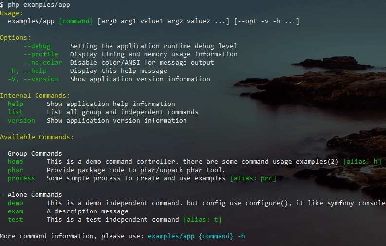
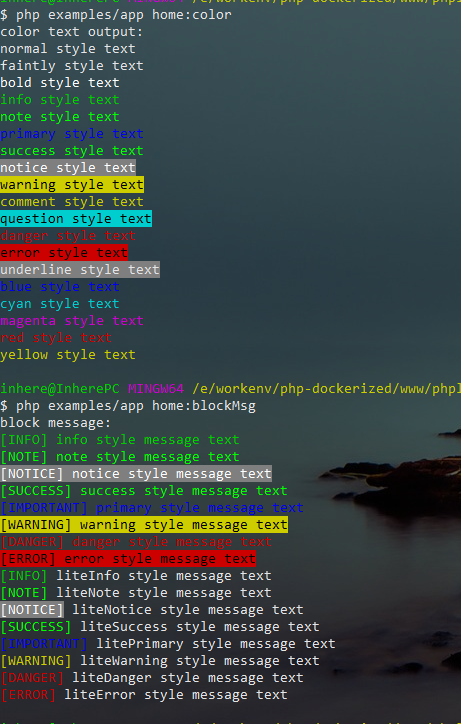
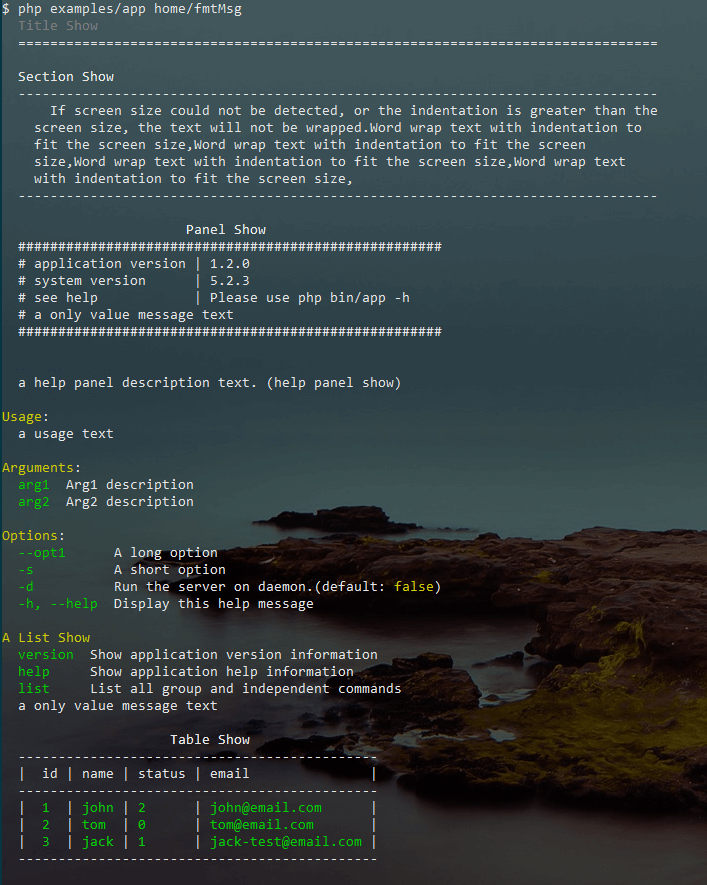

# console application lib 

[](LICENSE-2.0.txt)
[](https://packagist.org/packages/inhere/console)
[](https://packagist.org/packages/inhere/console)

a php console application library.

- console application, run command/controller
- console command-line params parse
- console `input`, `output`
- console color support, format message output
- console interactive

[中文README](./README.md)

## project

- **github** https://github.com/inhere/php-console.git
- **git@osc** https://git.oschina.net/inhere/php-console.git

**NOTICE**

- master branch -- is require `php >= 7` (recommended use)。
- php5 branch -- It's a branch of PHP 5, but it hasn't been updated for some time (the basic functionality is complete).

## install

- by composer

edit `composer.json`，at `require` add

```
"inhere/console": "dev-master",
// "inhere/console": "dev-php5", // for php5
```

run: `composer update`

- Direct fetch

```
git clone https://git.oschina.net/inhere/php-console.git // git@osc
git clone https://github.com/inhere/php-console.git // github
```

## usage

```php
use Inhere\Console\IO\Input;
use Inhere\Console\IO\Output;
use Inhere\Console\Application;

$meta = [
    'name' => 'My Console App',
    'version' => '1.0.2',
];
$input = new Input;
$output = new Output;
$app = new Application($meta, $input, $output);

// add command routes
$app->command('demo', function (Input $in, Output $out) {
    $cmd = $in->getCommand();

    $out->info('hello, this is a test command: ' . $cmd);
});

// run
$app->run();
```

now, you can see:



## input

example(in terminal):

```bash
$ examples/app home/useArg status=2 name=john arg0 -s=test --page=23 --id=154 -e dev -v vvv -d -rf --debug --test=false
```

**NOTICE:**

- These words will be as a Boolean(`true`) value: `on|yes|true` 
- These words will be as a Boolean(`false`) value: `off|no|false` 

get command info:

```php
echo $input->getScript();   // 'examples/app'
echo $input->getCommand(); // 'home/useArg'
```

get parsed arguments:

```php
var_dump($input->getArgs());
```

output:

```php
array(3) {
  'status' => string(1) "2"
  'name' => string(4) "john"
  [0] => string(4) "arg0"
}
```

get parsed options:

```php
var_dump($input->getOpts());
```

output:

```php
array(10) {          
  's' => string(4) "test"   
  'e' => string(3) "dev"    
  'v' => string(3) "vvv"    
  'd' => bool(true)         
  'r' => bool(true)         
  'f' => bool(true)         
  'page' => string(2) "23"     
  'id' =>   string(3) "154"    
  'debug' => bool(true)         
  'test' => bool(false)        
}
```

more method:

```php
// argument
$first = $input->getFirstArg(); // 'arg0'
$status = $input->get('status', 'default'); // '2'

// option
$page = $input->getOpt('page') // '23'
$debug = $input->boolOpt('debug') // True
$test = $input->boolOpt('test') // False
```

### get user input:

```php
echo "Your name:";

$text = $input->read(); 
// in terminal
// Your name: simon

echo $text; // 'simon'
```

## output

basic output:

```php
public function write(mixed $messages = '', $nl = true, $quit = false)
```

```php
$output->write('hello');
```

### formatted output

#### use color style 



#### special format output

- `$output->title()`
- `$output->section()`
- `$output->panel()`
- `$output->table()`
- `$output->helpPanel()`



## more interactive

in the class `Inhere\Console\Utils\Interact`

interactive method:

### `Interact::select()` (alias `Interact::choice()`)

Select one of the options

```php
select($description, $options, $default = null, $allowExit=true)
choice($description, $options, $default = null, $allowExit=true)
```

- example 1:

 only values, no setting option

```php
$select = Interact::select('Your city is ?', [
    'chengdu', 'beijing', 'shanghai'
]);

```

output in terminal:

```
Your city is ? 
  0) chengdu
  1) beijing
  2) shanghai
  q) Quit // quit option. is auto add. can setting it by 4th argument.
You choice: 0
```

```php
echo $select; // '0'
```

- example 2:

custom option, setting a default value.

```php
$select = Interact::select('Your city is ?', [
    'a' => 'chengdu',
    'b' => 'beijing',
    'c' => 'shanghai'
], 'a');
```

output in terminal:

```
Your city is? 
  a) chengdu
  b) beijing
  c) shanghai
  q) Quit // quit option. is auto add. can setting it by 4th argument.
You choice[default:a] : b
```

```php
echo $select; // 'b'
```

### `Interact::confirm()`

```php
public static function confirm($question, $default = true) bool
```

usage:


```php
$result = Interact::confirm('Whether you want to continue ?');
```

output in terminal:

```
Whether you want to continue ?
Please confirm (yes|no) [default:yes]: n
```

result: 

```php
var_dump($result); // bool(false)
```

### `Interact::question()`/`Interact::ask()`

```php
public static function ask($question, $default = null, \Closure $validator = null)
public static function question($question, $default = null, \Closure $validator = null)
```

```php
 $answer = Interact::ask('Please input your name?', null, function ($answer) {
     if ( !preg_match('/\w+/', $answer) ) {
         Interact::error('The name must match "/\w+/"');

         return false;
     }

     return true;
  });
```
## License

MIT
